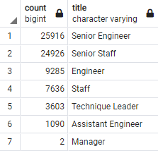

# Pewlett-Hackard-Analysis
Module 7

## Overview

Analysis was performed to determine the nuber of retiring employees by title.  Analysis also determined eligibility of employees close to retirement for participation in the mentorship program. The mentorship program will allow those close to retirement to mentor a new generation of employees to fill those vacated roles at Pewlett-Hackard and ease into the large transition for the complany.

## Results

### Retiring Employees

The number of retiring employees is:
  - greatest in the Senior Engineer and Senior Staff positions
  - least in the Manager position
  
 
 
 - A full list of all retiring employees is available in the Data folder as unique_titles.csv and includes 72,458 employees. 

### Mentorship Eligible Employees
 
- There are 1,549 employees eligible for the mentorship program. 
  - A full list of mentor eligible employees is available in the Data folder as mentorship_eligibility.csv.
  
- An additional breakdown analysis of mentoring titles shows a variety of titles represented in the program. 

## Analysis

The written analysis has the following:

Results:

There is a bulleted list with four major points from the two analysis deliverables. (6 pt)
Summary:

The summary addresses the two questions and contains two additional queries or tables that may provide more insight. (5 pt)
