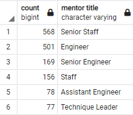

# Pewlett-Hackard-Analysis
Module 7

## Overview

Analysis was performed to determine the nuber of retiring employees by title.  Analysis also determined eligibility of employees close to retirement for participation in the mentorship program. The mentorship program will allow those close to retirement to mentor a new generation of employees to fill those vacated roles at Pewlett-Hackard and ease into the large transition for the complany.

## Results

### Retiring Employees

The number of retiring employees is:
  - greatest in the Senior Engineer and Senior Staff positions
  - least in the Manager position
  
 
 
 - A full list of all retiring employees is available in the Data folder as unique_titles.csv and includes 72,458 employees. 

### Mentorship Eligible Employees
 
- There are 1,549 employees eligible for the mentorship program. 
  - A full list of mentor eligible employees is available in the Data folder as mentorship_eligibility.csv.
  
- An additional breakdown analysis of mentoring titles shows a variety of titles represented in the program. 

## Additional Analysis

An additional query was included in the results section and added to the Employee_Database_challenge.sql file.  This query was performed to analyze the title break down for the mentorship program.  These results were compared to the retiring titles in an attempt to discover "holes" where additional training may be needed for the promoted employees or new hires.  Based on this analysis, it was noted that Managers did not have anyone available for mentoring as those retirees left the company.

Additional analysis was done to see if a possible solution could be reached:

- Determine if there are mentors availble for Managers.
  - consider a retiring employee that may wish to stay on with the company part time; 2 are identified
  - consider a current employee that is in the next round of the "close to retirement" group
     - one year younger did not return any managers, so this option will not be feasible
     - one year older returned 1 candidate 
     
  
  
  - increase the age (birth date) window for the mentorship program
     - if increased for the date range between 1956 and 1964, 18 Managers are identified that may be good candidates for mentors
     - if adjusted to a younger employee window (1966-1970), no managers are identified

## Summary:

The summary addresses the two questions and contains two additional queries or tables that may provide more insight. (5 pt)
